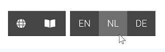
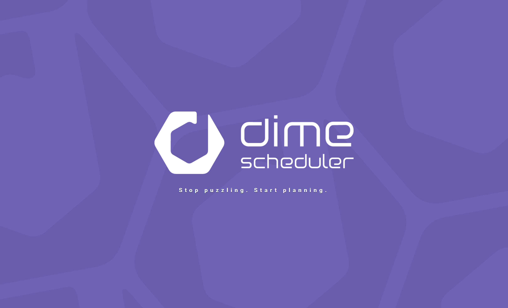
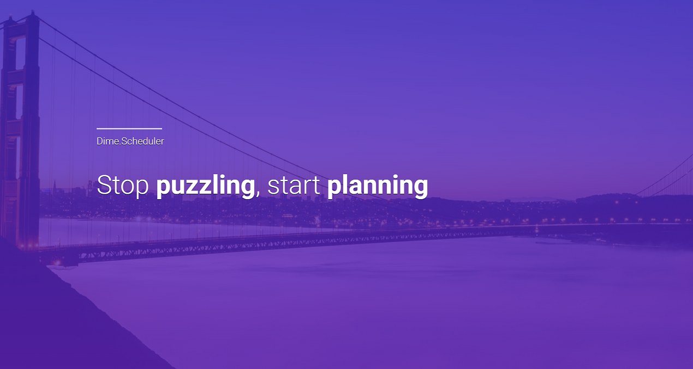
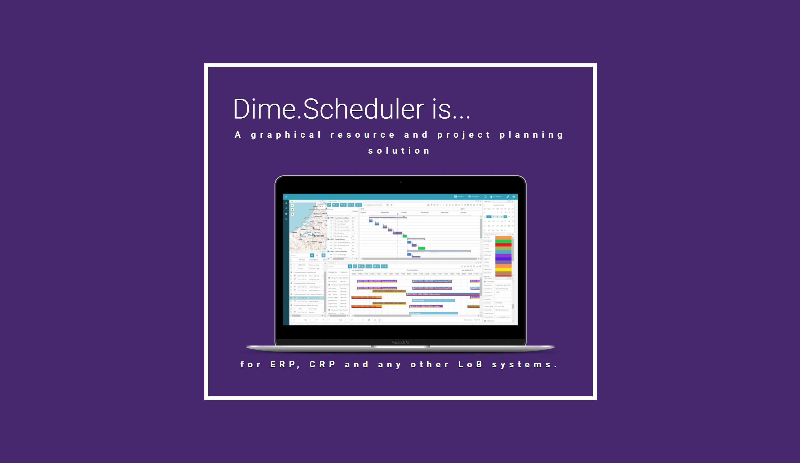
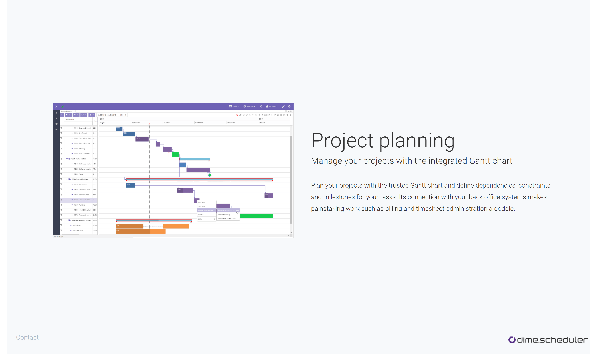
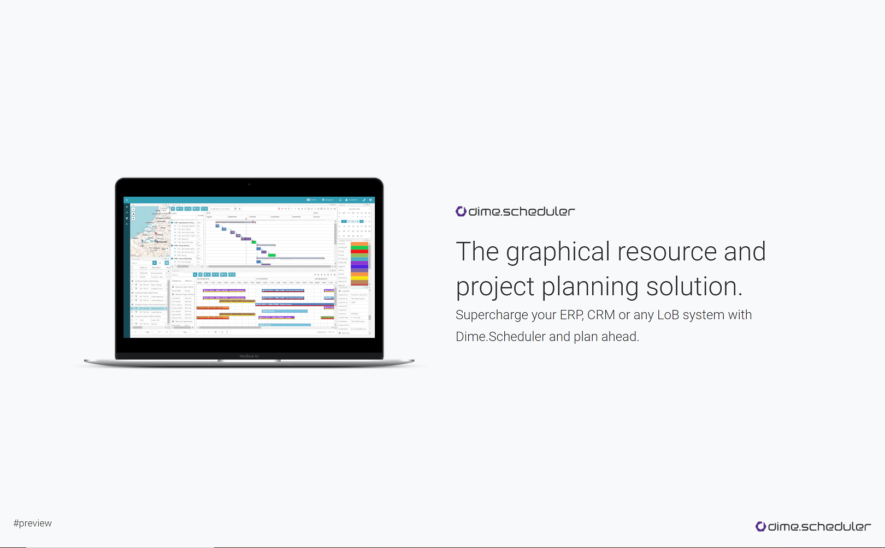

    

       

<h1 align="center">Introduction to Dime.Scheduler slide deck </h1>

Visit the slide deck on [intro.dimescheduler.com](https://intro.dimescheduler.com). Best viewed on a desktop or laptop.

## About the project

The main goal of this project is to show what Dime.Scheduler is and what kind of business challenges it aims to tackle. It provides the necessary content for potential customers and resellers to learn what it is meant to do and how it does it.

## Languages

There are two ways to change languages. The first is by using the navigation menu in the header:

The other method is by using a query string parameter.
Add a query string parameter named `lng` and use one of the supported languages:

| Language | Code |
| -------- | ---- |
| Dutch    | nl   |
| German   | de   |

Because a query string is used, the URL can be bookmarked. For example: `https://intro.dimescheduler.com?lng=nl` will set the language to Dutch by default.

By default, English is used. No query string needs to be passed to use the default language.

## Scripts

This project was bootstrapped with [Create React App](https://github.com/facebook/create-react-app). The usual commands have been kept. In this directory, you can run the following commands:

### `yarn start`

Runs the app in the development mode. Open [http://localhost:3000](http://localhost:3000) to view it in the browser.

The page will reload if you make edits.You will also see any lint errors in the console.

### `yarn build`

Builds the app for production to the `build` folder.
It correctly bundles React in production mode and optimizes the build for the best performance.

The build is minified and the filenames include the hashes.
Your app is ready to be deployed!

See the section about [deployment](https://facebook.github.io/create-react-app/docs/deployment) for more information.

### `yarn test`

Launches the test runner in the interactive watch mode.
See the section about [running tests](https://facebook.github.io/create-react-app/docs/running-tests) for more information.

### `yarn run eject`

**Note: this is a one-way operation. Once you `eject`, you can’t go back!**

If you aren’t satisfied with the build tool and configuration choices, you can `eject` at any time. This command will remove the single build dependency from your project.

Instead, it will copy all the configuration files and the transitive dependencies (webpack, Babel, ESLint, etc) right into your project so you have full control over them. All of the commands except `eject` will still work, but they will point to the copied scripts so you can tweak them. At this point you’re on your own.

You don’t have to ever use `eject`. The curated feature set is suitable for small and middle deployments, and you shouldn’t feel obligated to use this feature. However we understand that this tool wouldn’t be useful if you couldn’t customize it when you are ready for it.

## Deployment to GitHub pages

Run `yarn deploy` to build and deploy the static website to the gh-pages branch.

Go to the repository's settings and set `intro.dimescheduler.com` to the Custom domain field of the GitHub pages section.

## Learn More

You can learn more in the [Create React App documentation](https://facebook.github.io/create-react-app/docs/getting-started).
To learn React, check out the [React documentation](https://reactjs.org/).

## Screenshots

